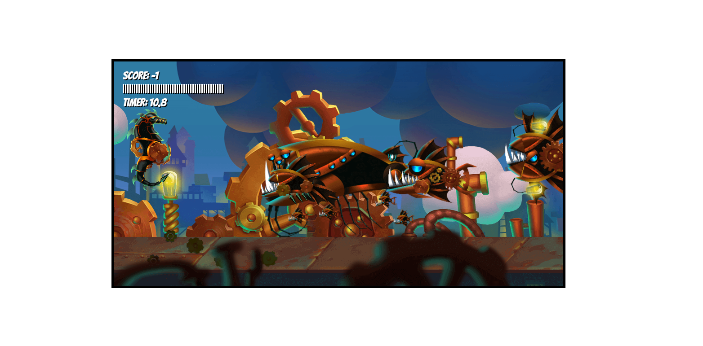

# The Warrior
This game was created using JavaScript, CSS and HTML

<a name="readme-top"></a>

<div align="center">
  
  <br/>

  <h3><b>The Warrior</b></h3>

</div>

<!-- TABLE OF CONTENTS -->

# 📗 Table of Contents

- [The Warrior](#the-warrior)
- [📗 Table of Contents](#-table-of-contents)
- [📖 The Warrior ](#-the-warrior-)
  - [🛠 Built With ](#-built-with-)
    - [Tech Stack ](#tech-stack-)
    - [Key Features ](#key-features-)
  - [🚀 Live Demo ](#-live-demo-)
  - [💻 Getting Started ](#-getting-started-)
    - [Prerequisites](#prerequisites)
    - [Setup](#setup)
    - [Install](#install)
    - [Usage](#usage)
    - [Run tests](#run-tests)
    - [Deployment](#deployment)
  - [👥 Authors ](#-authors-)
  - [🔭 Future Features ](#-future-features-)
  - [🤝 Contributing ](#-contributing-)
  - [⭐️ Show your support ](#️-show-your-support-)
  - [🙏 Acknowledgments ](#-acknowledgments-)
  - [❓ FAQ (OPTIONAL) ](#-faq-optional-)
  - [📝 License ](#-license-)

<!-- PROJECT DESCRIPTION -->

# 📖 The Warrior <a name="about-project"></a>

**The Warrior:** is an interactive, browser-based 2D game developed using pure JavaScript. It features a dynamic environment, unique characters, various props, and intriguing sound effects. The player can control characters via keyboard inputs and utilize various power-ups and weapons to interact with the environment. The game shows a high degree of interactivity and is enriched with visually attractive assets and good sounds, providing a captivating user experience.

## 🛠 Built With <a name="built-with"></a>

### Tech Stack <a name="tech-stack"></a>

<details>
  <summary>Client</summary>
  <ul>
    <li><a href="https://developer.mozilla.org/es/docs/Learn/HTML">HTML</a></li>
    <li><a href="https://developer.mozilla.org/es/docs/Web/CSS">CSS</a></li>
    <li><a href="https://developer.mozilla.org/en-US/docs/Web/JavaScript">JavaScript</a></li>
  </ul>
</details>

<!-- Features -->

### Key Features <a name="key-features"></a>

- **Interactive game.**
- **2D game.**

<p align="right">(<a href="#readme-top">back to top</a>)</p>

<!-- LIVE DEMO -->

## 🚀 Live Demo <a name="live-demo"></a>

- [Live Demo Link](https://alejandroq12.github.io/javascript-game/)

<p align="right">(<a href="#readme-top">back to top</a>)</p>

<!-- GETTING STARTED -->

## 💻 Getting Started <a name="getting-started"></a>

To get a local copy up and running, follow these steps.

### Prerequisites

To execute this project, all you require is a web browser.
Note: If you wish to modify the code, you will also need a code editor such as Visual Studio Code.


### Setup

Clone this repository to your desired folder:

```sh
  cd my-folder
  git clone https://github.com/Alejandroq12/javascript-game.git
```

### Install

You can install necessary software or dependencies for this project using the following command:

No additional installations are necessary due to the nature of this project.

### Usage

To run the project just open the `index.html` file with you web browser.

### Run tests

Test will be available in the future. I am working on it.

### Deployment

You can deploy this project using GitHub pages:

1. Log in to your GitHub account and navigate to the repository that contains your website files.
2. Make sure that your website files are located in the main branch and in the root directory of the repository.
3. If your website is not already live, make sure that the index.html file is the main page of your website.
4. Click on the "Settings" tab in your repository.
5. Scroll down to the "GitHub Pages" section.
6. In the "Source" dropdown menu, select the branch where your website files are located. For a simple website with only HTML and CSS, this is typically the main branch.
7. In the "Path" field, make sure that the root directory is specified (i.e., "/").
8. Click "Save" to generate your website.
9. Wait a few minutes for GitHub to build and deploy your website.
10. Once the website is deployed, visit the GitHub Pages URL to view your site.

<p align="right">(<a href="#readme-top">back to top</a>)</p>

<!-- AUTHORS -->

## 👥 Authors <a name="authors"></a>

👤 **Julio Quezada**

- GitHub: [Alejandroq12](https://github.com/Alejandroq12)
- Twitter: [@JulioAle54](https://twitter.com/JulioAle54)
- LinkedIn: [Julio Quezada](https://www.linkedin.com/in/quezadajulio/)

<p align="right">(<a href="#readme-top">back to top</a>)</p>

<!-- FUTURE FEATURES -->

## 🔭 Future Features <a name="future-features"></a>

> Describe 1 - 3 features you will add to the project.

- [ ] **[new_feature_1]**
- [ ] **[new_feature_2]**
- [ ] **[new_feature_3]**

<p align="right">(<a href="#readme-top">back to top</a>)</p>

<!-- CONTRIBUTING -->

## 🤝 Contributing <a name="contributing"></a>

Contributions, issues, and feature requests are welcome!

Feel free to check the [issues page](../../issues/).

<p align="right">(<a href="#readme-top">back to top</a>)</p>

<!-- SUPPORT -->

## ⭐️ Show your support <a name="support"></a>

> Write a message to encourage readers to support your project

If you like this project...

<p align="right">(<a href="#readme-top">back to top</a>)</p>

<!-- ACKNOWLEDGEMENTS -->

## 🙏 Acknowledgments <a name="acknowledgements"></a>

> Give credit to everyone who inspired your codebase.

I would like to thank...

<p align="right">(<a href="#readme-top">back to top</a>)</p>

<!-- FAQ (optional) -->

## ❓ FAQ (OPTIONAL) <a name="faq"></a>

> Add at least 2 questions new developers would ask when they decide to use your project.

- **[Question_1]**

  - [Answer_1]

- **[Question_2]**

  - [Answer_2]

<p align="right">(<a href="#readme-top">back to top</a>)</p>

<!-- LICENSE -->

## 📝 License <a name="license"></a>

This project is [MIT](./LICENSE) licensed.

_NOTE: we recommend using the [MIT license](https://choosealicense.com/licenses/mit/) - you can set it up quickly by [using templates available on GitHub](https://docs.github.com/en/communities/setting-up-your-project-for-healthy-contributions/adding-a-license-to-a-repository). You can also use [any other license](https://choosealicense.com/licenses/) if you wish._

<p align="right">(<a href="#readme-top">back to top</a>)</p>

